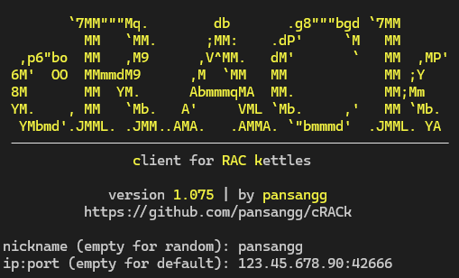
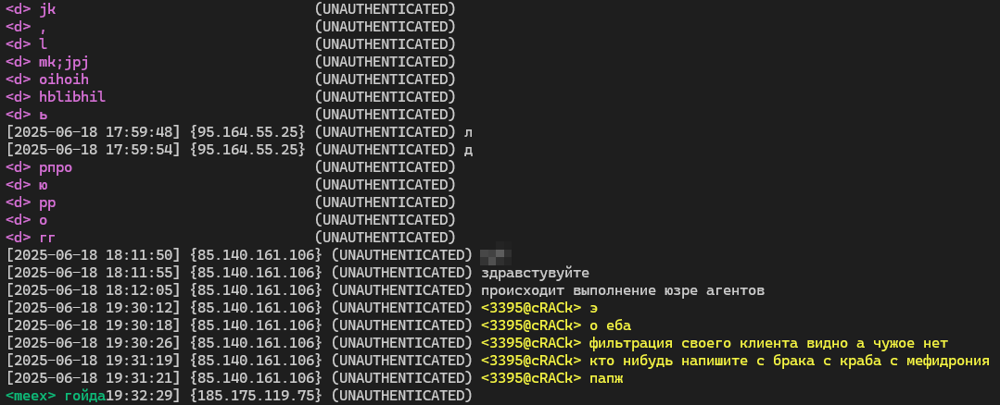

# cRACk 2.0ь
**c**lient for **RAC** **k**ettles

cRACk is TUI client for [RAC](https://github.com/The-Stratosphere-Solutions/RAC-Hub) v1.99.2, written on Python.

## features
- easy configurable
- IP hiding
- update checking
- supports RAC v2.0
- user friendly
- supports [user-agents](https://github.com/MeexReay/bRAC/blob/main/docs/user_agents.md)
- very lightweight

## quick start
### for Windows
use executable from [latest release](https://github.com/pansangg/cRACk/releases/latest),\
or run `main.py` with python interpreter.

### for Linux
use binary from [latest release](https://github.com/pansangg/cRACk/releases/latest),\
or run `main.py` with python interpreter.
> note: can be more unstable than Windows version

### for other OSes
run `main.py` with python interpreter,\
or [build it from source](#building-from-source) for yourself

## building from source
1) install python

https://www.python.org/downloads

2) download this repo or clone it using git
```
git clone https://github.com/pansangg/cRACk.git
```
3) install pyinstaller
```
pip install pyinstaller
```
4) in the same directory where the main.py is located run
```
python -m PyInstaller --onefile main.py
```
5) done. check /dist folder

## screenshots
Choosing nickname and host\
\
Chatting with others\


## TODO
- [x] fix ctrl+c exit
- [x] add user-agents support
- [x] add first-time config
- [x] add saving config
- [x] add MOTDs
- [x] add support for [RAC v2](https://github.com/The-Stratosphere-Solutions/RAC-Hub/blob/main/RACv2.md) (auth)
- [ ] add support for [WRAC v2](https://github.com/The-Stratosphere-Solutions/RAC-Hub/blob/main/WRAC.md)
- [x] fix "data_size lower than last_size" crash
- [x] add ANSI filter
- [x] add some colors you know
- [x] add random nickname option
- [x] ~~how to leave the server??~~ restart client
- [x] add screenshots
- [x] hide your ip
- [ ] add faking user-agents
- [ ] add commands

## license
this project is licensed under GPL-3.0 license.

## see also
- [RAC-Hub](https://github.com/The-Stratosphere-Solutions/RAC-Hub)
- [about RAC (v1.99)](https://github.com/The-Stratosphere-Solutions/RAC-Hub/blob/main/RACv1.99.md)
- [about RAC (v2)](https://github.com/The-Stratosphere-Solutions/RAC-Hub/blob/main/RACv2.md)
- [about WRAC (v2)](https://github.com/The-Stratosphere-Solutions/RAC-Hub/blob/main/WRAC.md)
- [bRAC - better RAC client](https://github.com/MeexReay/bRAC)
- [Mefedroniy - TUI RAC client](https://github.com/OctoBanon-Main/mefedroniy-client)
- [RAC user-agents](https://github.com/MeexReay/bRAC/blob/main/docs/user_agents.md)